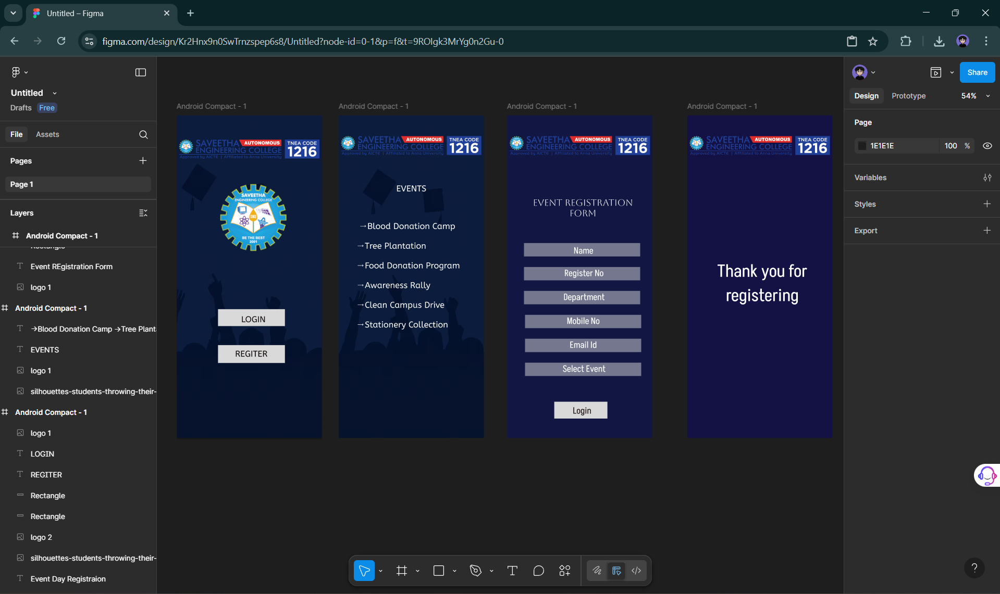

# Ex09 Event Registration Web Application
## Date: 21-05-2025

## AIM:
To design, develop and deploy a web application for event registration.

## DESIGN STEPS:

### Step 1:
Create a new frame.

### Step 2:
Select any one preset size of your choice.

### Step 3:
Select the shapes you need.

### Step 4:
Import images as needed.

### Step 5:
Create pages based on your need and link them.

### Step 6:

Validate the HTML and CSS code.

### Step 6:

Publish the website in the given URL.

## DESIGN TOOL:
Figma

## CODE:

home page
```
<!DOCTYPE html>
<html>
  <head>
    <meta name="viewport" content="width=device-width, initial-scale=1" />
    <meta charset="utf-8" />
    <link rel="stylesheet" href="globals.css" />
    <link rel="stylesheet" href="style.css" />
  </head>
  <body>
    <div class="android-compact">
      <div class="overlap-group-wrapper">
        <div class="overlap-group">
          <div class="text-wrapper">Event Day Registraion</div>
          
          
          <div class="rectangle"></div>
          <div class="div"></div>
          <div class="text-wrapper-2">REGITER</div>
          <div class="text-wrapper-3">LOGIN</div>
          
        </div>
      </div>
    </div>
  </body>
</html>

.android-compact {
  background-color: #69647c;
  display: flex;
  flex-direction: row;
  justify-content: center;
  width: 100%;
}

.android-compact .overlap-group-wrapper {
  background-color: #69647c;
  width: 412px;
  height: 917px;
}

.android-compact .overlap-group {
  position: relative;
  height: 917px;
}

.android-compact .text-wrapper {
  position: absolute;
  width: 251px;
  top: 409px;
  left: 92px;
  font-family: "Julius Sans One-Regular", Helvetica;
  font-weight: 400;
  color: #ffffff;
  font-size: 32px;
  text-align: center;
  letter-spacing: 0;
  line-height: normal;
}

.android-compact .silhouettes-students {
  position: absolute;
  width: 412px;
  height: 917px;
  top: 0;
  left: 0;
  object-fit: cover;
}

.android-compact .logo {
  width: 243px;
  height: 213px;
  top: 176px;
  left: 90px;
  position: absolute;
  object-fit: cover;
}

.android-compact .rectangle {
  position: absolute;
  width: 190px;
  height: 51px;
  top: 653px;
  left: 117px;
  background-color: #d9d9d9;
}

.android-compact .div {
  position: absolute;
  width: 190px;
  height: 48px;
  top: 551px;
  left: 117px;
  background-color: #d9d9d9;
}

.android-compact .text-wrapper-2 {
  position: absolute;
  width: 181px;
  top: 663px;
  left: 121px;
  font-family: "ABeeZee-Regular", Helvetica;
  font-weight: 400;
  color: #0d0505;
  font-size: 24px;
  text-align: center;
  letter-spacing: 0;
  line-height: normal;
}

.android-compact .text-wrapper-3 {
  position: absolute;
  width: 175px;
  top: 565px;
  left: 130px;
  font-family: "ABeeZee-Regular", Helvetica;
  font-weight: 400;
  color: #110c0c;
  font-size: 24px;
  text-align: center;
  letter-spacing: 0;
  line-height: normal;
}

.android-compact .img {
  width: 412px;
  height: 62px;
  top: 65px;
  left: 0;
  position: absolute;
  object-fit: cover;
}
```
Event page
```
<!DOCTYPE html>
<html>
  <head>
    <meta name="viewport" content="width=device-width, initial-scale=1" />
    <meta charset="utf-8" />
    <link rel="stylesheet" href="globals.css" />
    <link rel="stylesheet" href="style.css" />
  </head>
  <body>
    <div class="android-compact">
      <div class="overlap-group-wrapper">
        <div class="overlap-group">
          
          <div class="text-wrapper">EVENTS</div>
          <p class="blood-donation-camp">
            →Blood Donation Camp<br /><br />→Tree Plantation<br />
            <br />→Food Donation Program<br /><br />→Awareness Rally<br />
            <br />→Clean Campus Drive<br /><br />→Stationery Collection
          </p>
        </div>
      </div>
    </div>
  </body>
</html>

.android-compact {
  background-color: #ffffff;
  display: flex;
  flex-direction: row;
  justify-content: center;
  width: 100%;
}

.android-compact .overlap-group-wrapper {
  background-color: #ffffff;
  width: 412px;
  height: 917px;
}

.android-compact .overlap-group {
  position: relative;
  height: 917px;
  background-image: url(./img/silhouettes-students-throwing-their-caps-air-graduation-1100672-19643-1.png);
  background-size: cover;
  background-position: 50% 50%;
}

.android-compact .logo {
  position: absolute;
  width: 412px;
  height: 62px;
  top: 55px;
  left: 0;
  object-fit: cover;
}

.android-compact .text-wrapper {
  position: absolute;
  width: 206px;
  top: 193px;
  left: 103px;
  font-family: "ABeeZee-Regular", Helvetica;
  font-weight: 400;
  color: #ffffff;
  font-size: 24px;
  text-align: center;
  letter-spacing: 0;
  line-height: normal;
}

.android-compact .blood-donation-camp {
  position: absolute;
  width: 310px;
  top: 300px;
  left: 50px;
  font-family: "ABeeZee-Regular", Helvetica;
  font-weight: 400;
  color: #ffffff;
  font-size: 24px;
  letter-spacing: 0;
  line-height: normal;
}

```
Registration page
```
<!DOCTYPE html>
<html>
  <head>
    <meta name="viewport" content="width=device-width, initial-scale=1" />
    <meta charset="utf-8" />
    <link rel="stylesheet" href="globals.css" />
    <link rel="stylesheet" href="style.css" />
  </head>
  <body>
    <div class="android-compact">
      <div class="div">
        
        <div class="text-wrapper">Event REgistration Form</div>
        <div class="overlap">
          <div class="rectangle"></div>
          <div class="text-wrapper-2">Name</div>
        </div>
        <div class="overlap-group">
          <div class="rectangle-2"></div>
          <div class="text-wrapper-3">Select Event</div>
        </div>
        <div class="overlap-group-2">
          <div class="rectangle-2"></div>
          <div class="text-wrapper-4">Mobile No</div>
        </div>
        <div class="overlap-2">
          <div class="rectangle-2"></div>
          <div class="text-wrapper-4">Email Id</div>
        </div>
        <div class="overlap-3">
          <div class="rectangle-2"></div>
          <div class="text-wrapper-5">Register No</div>
        </div>
        <div class="overlap-4">
          <div class="rectangle-2"></div>
          <div class="text-wrapper-6">Department</div>
        </div>
        <div class="overlap-5">
          <div class="rectangle-3"></div>
          <div class="text-wrapper-7">Login</div>
        </div>
      </div>
    </div>
  </body>
</html>

.android-compact {
  background-color: #101542;
  display: flex;
  flex-direction: row;
  justify-content: center;
  width: 100%;
}

.android-compact .div {
  background-color: #101542;
  width: 412px;
  height: 917px;
  position: relative;
}

.android-compact .logo {
  position: absolute;
  width: 412px;
  height: 62px;
  top: 55px;
  left: 0;
  object-fit: cover;
}

.android-compact .text-wrapper {
  position: absolute;
  width: 287px;
  top: 232px;
  left: 71px;
  font-family: "Aboreto-Regular", Helvetica;
  font-weight: 400;
  color: #ffffff;
  font-size: 26px;
  text-align: center;
  letter-spacing: 0;
  line-height: normal;
}

.android-compact .overlap {
  position: absolute;
  width: 335px;
  height: 38px;
  top: 363px;
  left: 47px;
}

.android-compact .rectangle {
  width: 330px;
  height: 38px;
  left: 0;
  opacity: 0.5;
  position: absolute;
  top: 0;
  background-color: #d9d9d9;
}

.android-compact .text-wrapper-2 {
  position: absolute;
  width: 332px;
  top: 3px;
  left: 3px;
  font-family: "Akshar-Regular", Helvetica;
  font-weight: 400;
  color: #ffffff;
  font-size: 26px;
  text-align: center;
  letter-spacing: 0;
  line-height: normal;
}

.android-compact .overlap-group {
  position: absolute;
  width: 333px;
  height: 41px;
  top: 702px;
  left: 50px;
}

.android-compact .rectangle-2 {
  position: absolute;
  width: 330px;
  height: 38px;
  top: 1px;
  left: 0;
  background-color: #d9d9d9;
  opacity: 0.5;
}

.android-compact .text-wrapper-3 {
  position: absolute;
  width: 330px;
  top: 0;
  left: 3px;
  font-family: "Akshar-Regular", Helvetica;
  font-weight: 400;
  color: #ffffff;
  font-size: 26px;
  text-align: center;
  letter-spacing: 0;
  line-height: normal;
}

.android-compact .overlap-group-2 {
  position: absolute;
  width: 330px;
  height: 41px;
  top: 566px;
  left: 50px;
}

.android-compact .text-wrapper-4 {
  position: absolute;
  width: 329px;
  top: 0;
  left: 1px;
  font-family: "Akshar-Regular", Helvetica;
  font-weight: 400;
  color: #ffffff;
  font-size: 26px;
  text-align: center;
  letter-spacing: 0;
  line-height: normal;
}

.android-compact .overlap-2 {
  position: absolute;
  width: 330px;
  height: 48px;
  top: 634px;
  left: 50px;
}

.android-compact .overlap-3 {
  position: absolute;
  width: 338px;
  height: 44px;
  top: 430px;
  left: 47px;
}

.android-compact .text-wrapper-5 {
  position: absolute;
  width: 335px;
  top: 0;
  left: 3px;
  font-family: "Akshar-Regular", Helvetica;
  font-weight: 400;
  color: #ffffff;
  font-size: 26px;
  text-align: center;
  letter-spacing: 0;
  line-height: normal;
}

.android-compact .overlap-4 {
  position: absolute;
  width: 336px;
  height: 44px;
  top: 498px;
  left: 47px;
}

.android-compact .text-wrapper-6 {
  position: absolute;
  width: 330px;
  top: 0;
  left: 6px;
  font-family: "Akshar-Regular", Helvetica;
  font-weight: 400;
  color: #ffffff;
  font-size: 26px;
  text-align: center;
  letter-spacing: 0;
  line-height: normal;
}

.android-compact .overlap-5 {
  position: absolute;
  width: 160px;
  height: 48px;
  top: 814px;
  left: 132px;
}

.android-compact .rectangle-3 {
  width: 151px;
  height: 48px;
  left: 1px;
  position: absolute;
  top: 0;
  background-color: #d9d9d9;
}

.android-compact .text-wrapper-7 {
  position: absolute;
  width: 160px;
  top: 7px;
  left: 0;
  font-family: "Akshar-Regular", Helvetica;
  font-weight: 400;
  color: #241717;
  font-size: 26px;
  text-align: center;
  letter-spacing: 0;
  line-height: normal;
  white-space: nowrap;
}
```

## OUTPUT:


## RESULT:
The program to design, develop and deploy a web application for event registration is completed successfully.
